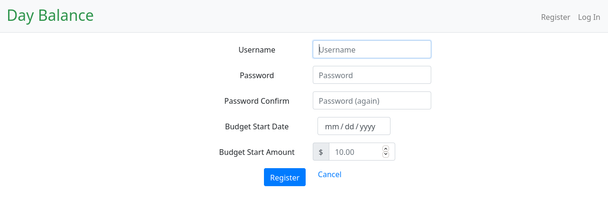
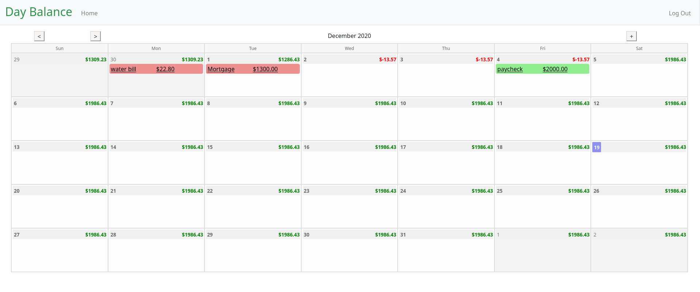
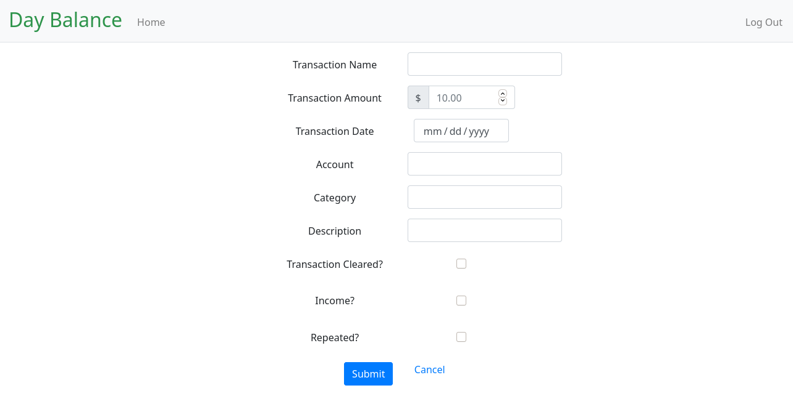

# DayBalance
This program is a calendar based account balance tracker.  This allows you to
enter your starting balance and future transactions so you can track your
future balance.

## Features

 - create account
 
 
 - home screen
 
 
 - add transaction
 

 - modify transaction
 - delete transaction

## Future Features

 - recurring transactions
 - support multiple accounts

### Author
My name is Brian Ladner and I am a programmer from Dallas, TX.  This is my
final project for CS50x, the online Intro to Computer Science from Harvard.

