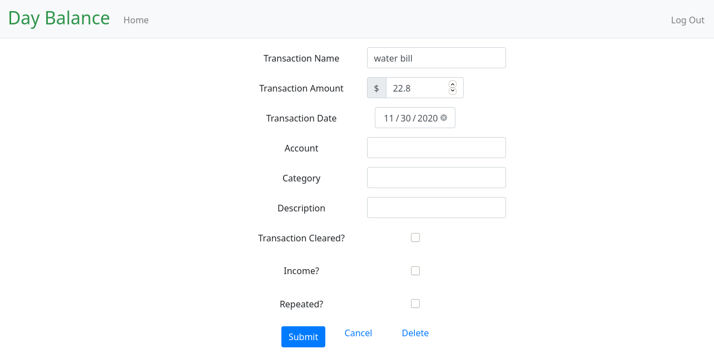

# DayBalance
This program is a calendar based account balance tracker.  This allows you to enter your starting balance and future transactions so you can track your future balance in a calendar view.

## Features
 
 - Create Account - create a unique account which includes a starting balance and starting date
 
 
 - Home Screen - the main view where you see your balance over the whole month
 
 
 - Add Transaction - where you add bills and deposits with some basic information
 

 - Modify/Delete Transaction - Clicking on the transaction in the main calendar window gives you the option to modify or delete the transaction
 
 
## Future Features

 - recurring transactions
 - support multiple accounts
 - add side list view with filter by category

### Author
My name is Brian Ladner and I am a programmer from Dallas, TX.  This is my final project for CS50x, the online Intro to Computer Science class from Harvard.

